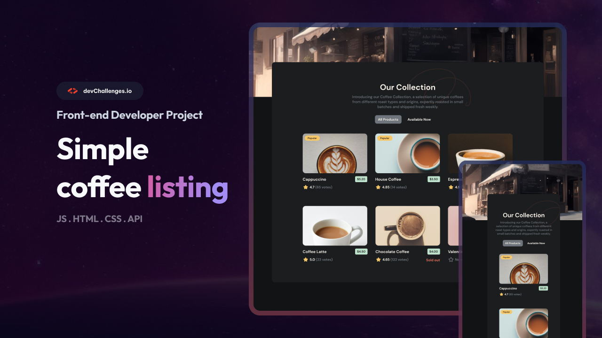

<h1 align="center">Bernardo Chagas | devChallenges</h1>

<div align="center">
   Solution for a challenge <a href="https://devchallenges.io/challenge/simple-coffee-listing" target="_blank">Simple Coffee Listing</a> from <a href="http://devchallenges.io" target="_blank">devChallenges.io</a>.
</div>

<div align="center">
  <h3>
    <a href="https://bechagas.github.io/coffee-listing-app/">
      Demo
    </a>
    <span> | </span>
    <a href="https://github.com/bechagas/coffee-listing-app">
      Solution
    </a>
    <span> | </span>
    <a href="https://devchallenges.io/challenge/simple-coffee-listing">
      Challenge
    </a>
  </h3>
</div>

<!-- TABLE OF CONTENTS -->

## Table of Contents

- [Overview](#overview)
  - [What I learned](#what-i-learned)
  - [Useful resources](#useful-resources)
- [Built with](#built-with)
- [Features](#features)
- [Author](#author)

<!-- OVERVIEW -->

## Overview



This project is a responsive coffee listing application that fetches data from an API and allows users to filter between all products and those currently available. It was built focusing on clean code, responsiveness, and accessibility.

### What I learned

During this challenge, I reinforced several important concepts:

- **Advanced CSS Grid:** Implementing a responsive grid that adapts from 3 columns on desktop/tablet to 1 column on mobile devices using media queries.
- **Margin Collapse & Layout Stacking:** Solved layout issues where the background image wouldn't align to the "ceiling" of the browser by using `display: flow-root` on the wrapper, preventing margin collapse between the parent and child elements.
- **Async Data Fetching in React:** Implemented robust data fetching using `useEffect` and `async/await`, including proper state management for **Loading** and **Error** states to improve user experience.
- **Web Accessibility (A11y):** Enhanced the filter buttons by adding `aria-pressed` attributes, ensuring that the active state is correctly communicated to assistive technologies.

```jsx
// Example of the accessible filter button implementation
<button
  className={`${styles.btn} ${currentFilter === 'all' ? styles.active : ''}`}
  onClick={() => handleFilter('all')}
  aria-pressed={currentFilter === 'all'}
>
  All Products
</button>
```

### Useful resources

- [MDN - CSS Grid Layout](https://developer.mozilla.org/en-US/docs/Web/CSS/CSS_grid_layout) - Essential for building the card collection.
- [Modern Guide to Margin Collapse](https://web.dev/articles/margin-collapse) - Helped in understanding why the background wasn't hitting the top of the viewport.

### Built with

- Semantic HTML5 markup
- CSS Custom Properties (Variables)
- CSS Modules (Scoped styling)
- Flexbox & CSS Grid
- [React 19](https://reactjs.org/)
- [Vite](https://vitejs.dev/)

## Features

- **Dynamic Data:** Fetches coffee data from an external JSON API.
- **Filtering:** Toggle between viewing all products or only those currently in stock.
- **Fully Responsive:** Optimized for Mobile, Tablet, and Desktop resolutions.
- **Polished UI:** Includes custom loading indicators and error handling for failed API requests.

## Author

- GitHub [@bechagas](https://github.com/bechagas)
